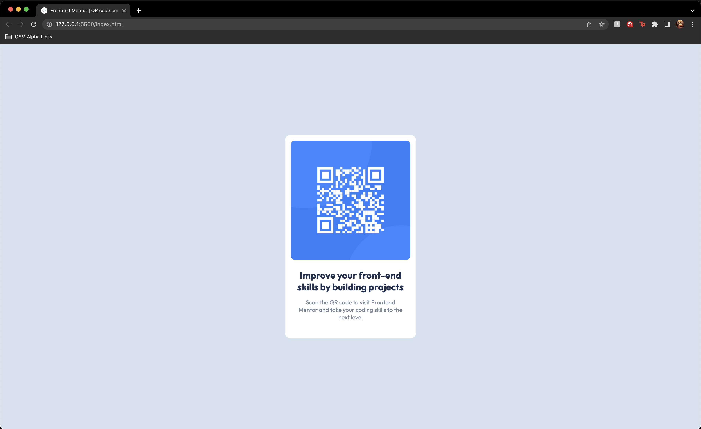

# Frontend Mentor - QR code component solution

This is a solution to the [QR code component challenge on Frontend Mentor](https://www.frontendmentor.io/challenges/qr-code-component-iux_sIO_H). Frontend Mentor challenges help you improve your coding skills by building realistic projects.

## Table of contents

-   [Overview](#overview)
    -   [Screenshot](#screenshot)
    -   [Links](#links)
-   [My process](#my-process)
    -   [Built with](#built-with)
    -   [What I learned](#what-i-learned)
    -   [Continued development](#continued-development)
    -   [Useful resources](#useful-resources)
-   [Author](#author)
-   [Acknowledgments](#acknowledgments)

## Overview

### Screenshot

### Links

-   Solution URL: [https://github.com/Shelton-Rolle/FrontendMentor-QR-Code](https://github.com/Shelton-Rolle/FrontendMentor-QR-Code)
-   Live Site URL: [https://frontend-mentor-qr-code-mpg8qn96s-shelton-rolle.vercel.app/](https://frontend-mentor-qr-code-mpg8qn96s-shelton-rolle.vercel.app/)

## My process

I started approaching this project by looking at how I think the project should be set up in html. I noticed we would need a card, that contained an image and text, so I concluded we could use a card div that contained an image and a div with some content.

After deciding on my approach, I created my main.css file which I would be using for styling. I added some boiler plate css and some root variables that contained the values listed in the style-guide provided.

With my css set up, I began adding in the html I had planned, and styled everything accordingly with css.

### Built with

-   Semantic HTML5 markup
-   CSS custom properties
-   Flexbox

## Author

-   Frontend Mentor - [@shelton-rolle](https://www.frontendmentor.io/profile/Shelton-Rolle)
